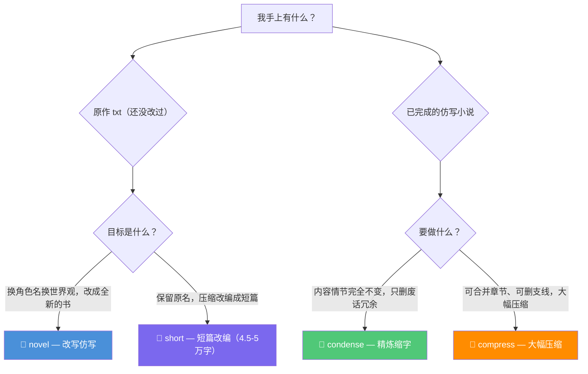
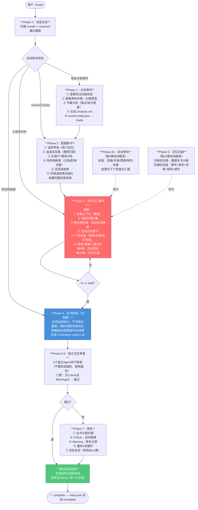
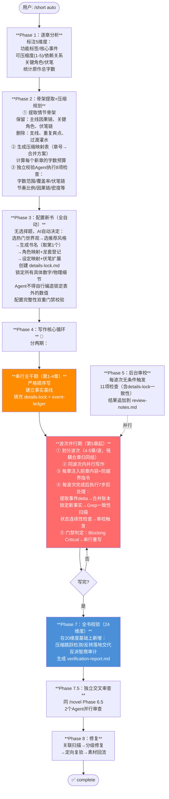
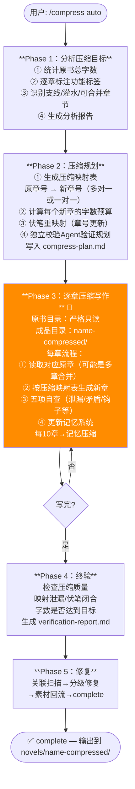
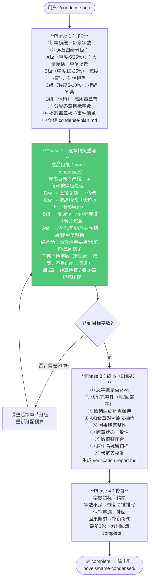
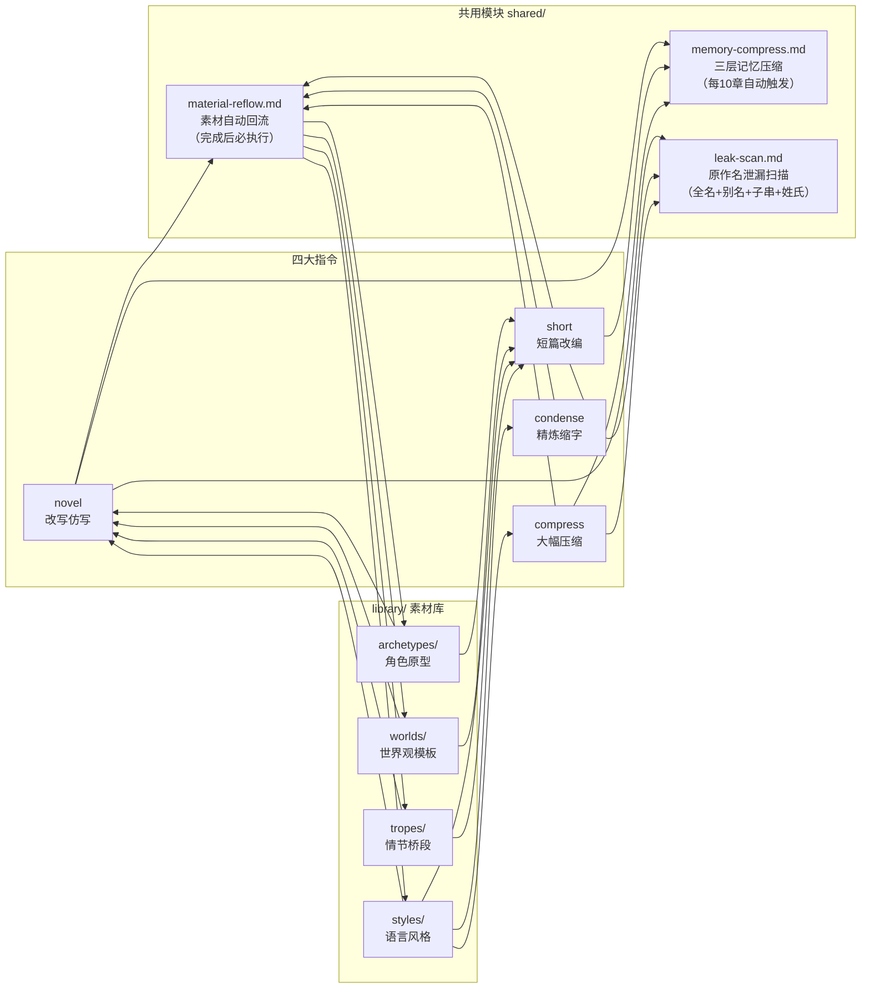
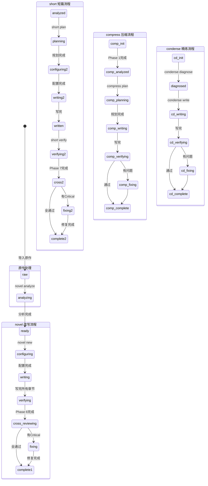

# 小说 Agent 系统：四大流程可视化梳理

> 面向新人的一图看懂版。四条指令分别解决不同场景，共用底层模块。

---

## 一、四大指令：定位一览

| 指令 | 中文名 | 输入 | 输出 | 核心特点 |
|------|--------|------|------|---------|
| `/novel` | **改写仿写** | 原作 txt | 全新小说（角色/设定全换） | 有人参与，选择题驱动 |
| `/short` | **短篇改编** | 原作 txt | 4.5-5万字短篇（角色/设定全换） | 全自动，并行写作 |
| `/compress` | **大幅压缩** | 已完成小说 | 同名压缩版（合章/删支线） | 全自动，不改名不改编 |
| `/condense` | **精炼缩字** | 已完成小说 | 精炼版（纯删冗余） | 全自动，字词级别 |

---

## 二、选哪个？决策树



---

## 三、/novel 改写仿写：主流程

**场景**：手上有原作 txt，想改成全新小说（新角色、新世界观、新名字）



**关键状态转换**：
```
raw → analyzing → ready → configuring → writing → verifying → cross-reviewing → fixing → complete
```

---

## 四、/short 短篇改编：主流程

**场景**：原作很长，要压缩改编成 4.5-5万字的新书（同样换角色换设定）



**与 /novel 的核心区别**：
- Phase 2 多了**压缩规划**（先算好哪些章合并）
- Phase 3 多了**details-lock**（事实锁定表，防AI编造数字）
- Phase 4 多了**波次并行**（更快写完）+ **event-ledger**（事件账本）
- 校验是 24 维度（比 /novel 多 4 个）

---

## 五、/compress 大幅压缩：主流程

**场景**：已有一本仿写完的小说，想大幅压缩（可合并章节、删支线），**保留原有角色名和设定名**



> ⚠️ 关键约束：① 角色名/设定名全部保持原样 ② 不建 character-map / setting-map ③ 原书目录严格只读，所有写操作在 `-compressed/` 下

---

## 六、/condense 精炼缩字：主流程

**场景**：已有一本仿写完的小说，内容和情节完全不变，只删掉废话、冗余描写，达到目标字数



> ⚠️ 关键约束：① 情节/角色/因果链完全不变 ② 只精炼文字表达 ③ 不合并章节、不删支线（这是与 `/compress` 的核心区别）

---

## 七、共用底层模块



---

## 八、全局状态机（meta.json status 字段）



---

## 九、三层记忆系统（/novel 和 /short 共用）

```
每次写章节时加载顺序：
┌─────────────────────────────────────────┐
│  第一层：memory-outline.md（≤2000字）    │  ← 全书大纲，每10章重建
│  全书走向、关键转折、当前局势、角色状态   │
├─────────────────────────────────────────┤
│  第二层：recent-context.md（无硬限制）   │  ← 最近10章详细上下文，每章追加
│  新增事实、角色状态、冲突、钩子           │
├─────────────────────────────────────────┤
│  第三层：archives/stage-*.md（每个≤500字）│  ← 历史归档，每10章压缩一次
│  已归档的早期章节压缩摘要                │
└─────────────────────────────────────────┘

写完→追加第二层 → 每10章→第二层最早内容压缩进第三层 + 重建第一层
```
